# Projeto: Previsão de vendas - Farmácias Rossmann

## 1. Contextualização 
A Rossmann é uma rede de mais de 3000 farmácias, que abrange 7 países da Europa. As vendas das lojas são influenciadas por diversos fatores, como sazonalidade, promoções, feriados escolares e estaduais e localização. Como é uma rede de lojas muito grande, a previsão de vendas para cada loja pode ser bastante variada.

## 2. Problema de negócio
O CFO da rede Rossmann, precisa saber a previsão de vendas para cada farmácia para as próximas semanas. A ideia é reservar parte dessa receita, para fazer uma reforma nas lojas. Estes resultados precisam ser facilmente acessados via web, para facilitar o planejamento do time de negócios.
Nota: Esse é um problema fictício, porém, muito próximo da realidade.

## 3. Planejamento da solução
Antes de iniciar o projeto, foi feito o planejamento da solução, onde foram traçadas as estratégias para atender cada necessidade para a execução das etapa do projeto: o produto final que será entregue, as ferramentas necessárias e o processo para atingir os resultadis esperados.

### 3.1 Produto final
A entrega combinada com o time de negócios foi a previsão de vendas das próximas 6 semanas, por loja, com acesso via web pelo celular através de um aplicativo de mensagens (Robô: Bot Telegram).

### 3.2 Ferramentas 
* Pandas
* Python
* Git e GitHub
* Jupyter Notebook
* Cloud
* Algoritmos de regressão
* Flask e API's Python 
* Bibliotecas de Machine Learning SkLearn

### 3.3 Processo: Estratégia para a solução do problema de negócio
A construção da solução foi esquematizada dentro da Metodologia de desenvolvimento de projetos CRISP, que é baseada em ciclos, potencializando a organziação e velocidade na entrega de resultados. Os ciclos estão organizados nas seguintes etapas:
a) Entendimento da questão de negócio, discussão dos pontos relevantes e possíveis dúvidas com o time de negócio, retaratndo as particularidades a serem atendidas no projeto.

b) Coleta de dados: Os dados serão coletados no formato .csv e divididos em treino e teste. Para este projeto de estudo, o dataset utilizado foi proveniente da Plataforma Kaggle.

c) Descrição dos dados: Noção de quantidade de dados, tipos de variáveis (numéricas, categóricas, temporal), estatística descritiva das variáveis numéricas.

d) Limpeza: drop ou substituição de valores nulos ou faltantes 

e) Feature engineering: Criação e derivação de novas variáveis

f) Filtragem das variáveis: Filtragem das linhas e seleção das colunas

g) Análise exploratória de dados(EDA): O objetivo da EDA é gerar insights a partir da análise de hipóteses e ter uma ideia das melhores variáveis para a modelagem de dados e a correlação entre elas. Essa etapa inicia na construção de um mapa de hipóteses (MindMap) com o objetivo de levantar hipóteses sobre as variáveis que influenciam o fenômeno de vendas. As análises são distribuídas em Univariada, Bivariada e Multivariada. 

h) Preparação dos dados: Transformação das variáveis de interesse (encoding, rescaling e transformação de natureza).

i) Seleção de features: Implementação do algoritmo Boruta para confirmar e escolher as features mais relevantes para a aprendizagem do modelo.

j) Modelo de Machine Learning: A solução do problema de negócio será atendida pela previsão de vendas o longo do tempo, ou seja, é um problema de regressão dentro da aprendizagem supervisionada. O baseline é um modelo de média e a partir deste resultado, aos dados de treino serão aplicados inicialmente, os algoritmos Linear Regression e Linear Regression Regularized Model, e na sequência os algoritmos Random Forest e XGBoost. Sob a observação do CrossValidation e aplicação dos melhores hiperparâmetros, cálculo de erro, observa-se a performance desses algoritmos, escolhendo o melhor modelo dentro dos melhores hiperparâmetros para aplicar aos dados de teste e produção.

k) Deploy do modelo: Sendo os resultados aceitos pelo time de negócio para o fechamento do primeiro ciclo, realiza-se o deploy do modelo e após a publicação, cria-se robô no aplicativo de mensagens Telegram com acesso à previsão de vendas das próximas 6 semanas, por loja, em tempo real.

## 4. Principais insights observados a partir da análise das hipóteses(Hn):
* H2. Lojas com competidores mais próximos vendem MENOS: Esta hipótese demonstrou ser falsa a partir da análise de dados. Existe uma correlação negativa entre as vendas e a distância entre as lojas. 
  
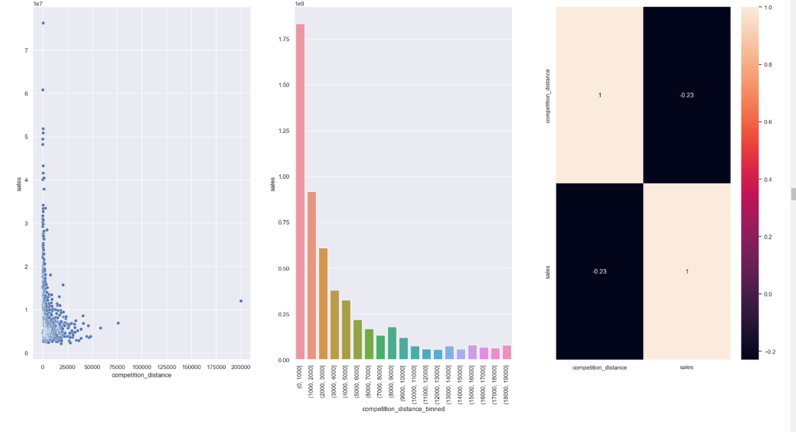

* H8. Lojas abertas durante o feriado de Natal vendem MAIS. Esta hipótese também é falsa. As vendas são menores durante o dia de Natal, comparado com os outros feriados e dias regulares.  
  
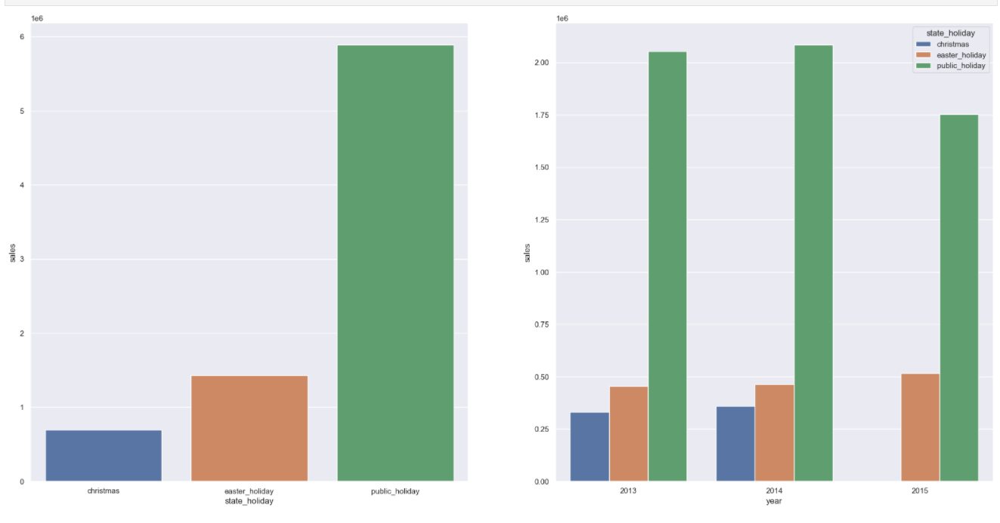

* H9. Lojas deveriam vender mais ao longo dos anos. Essa hipótese é falsa e pode ser um ponto de atenção, porque existe uma queda nas vendas ao longo do tempo. Nota: o ano de 2015 aqui não pode ser levado em consideração, porque o ano ainda corrente na época de coleta desses dados. 
  
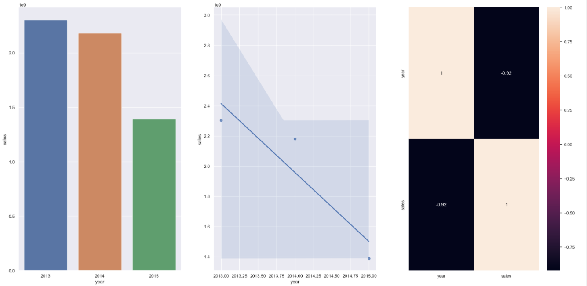

* H13. Lojas deveriam vender menos nos feriados escolares. Essa hipótese chama a atenção, porque, apesar de ser verdadeira, aprsenta dois meses como exceção, que são os meses de julho e agosto. Em um novo ciclo, poderia ser realizada a investigação sobre esse fenômeno. 
  
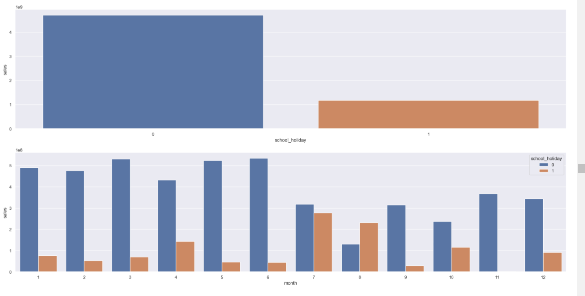

## 5. Resultado dos modelos de Machine Learning
Os algoritmos Linear Regression e Linear Regression Regularized Model, não obtiveram uma boa performance, porque os dados não apresentaram um comportamento "normal" (Gaussiano). Então, aplicou-se os algoritmos Random Forest e XGBoost. Sob a observação do CrossValidation e aplicação dos melhores hiperparâmetros, observou-se que a performance desses algoritmos estava parecida e aceitável para a conclusão do primeiro ciclo, sendo escolhido o XGBoost, por ser um modelo mais rápido e que necessita de menor capacidade computacional quando comparado ao Random Forest.
A partir do cálculo do erro, observou-se que o modelo de média (baseline) apresentou um erro absoluto (MAE) de R$1.354,00 nas vendas. Enquanto o XGBoost (antes de descoberta dos hiperparâmetros) apresentou um erro (MAE) de R$1.064,00 e depois de treinado com os melhores parâmetros, errou R$770,00. 

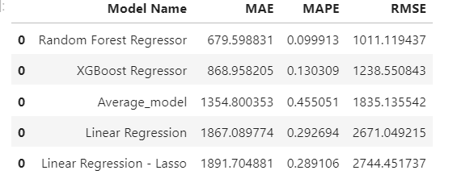
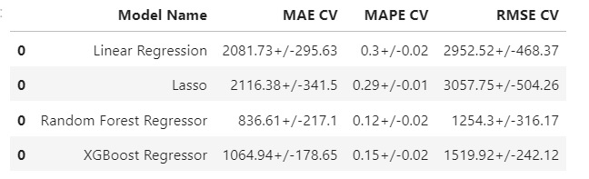
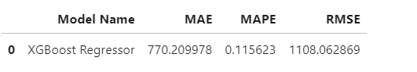

O gráfico abaixo demonstra a performance do modelo construído com o algoritmo XGBoost em comparação ao modelo baseline. 

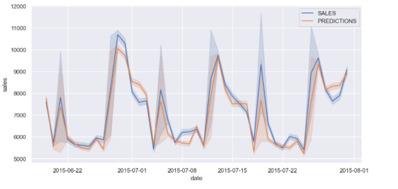

E, no gráfico abaixo, observa-se a performance do modelo XGBoost em formato de resíduos, mostrando quando o modelo subestima (erra ao prever menor valor de vendas do que o real) ou superstima (erra ao prever maior valor de vendas do que o real) as previsões. 

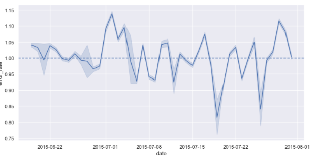

## 6. Conversão dos resultados para o Produto Financeiro
A partir das previsões do modelo selecionado é possível que o CFO conheça a receita das próximas 6 semanas de cada loja da rede de farmácias Rossmann. 
Na tabela abaixo, apresenta-se um exemplo dessa previsão para as lojas 20, 22 e 23. 

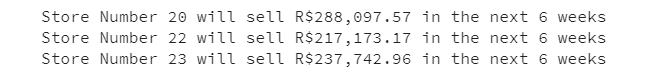

Também foi possível reportar a previsão de vendas das próximas 6 semanas, para todas as lojas, tendo em vista o melhor e o pior cenário, considerando o erro da previsão, como demonstra a tabela abaixo.  

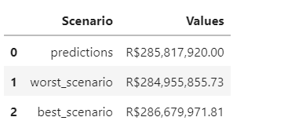

A tabela a seguir, demonstra de forma completa, a previsão, o melhor e pior cenário de vendas por loja, o erro médio absoluto (MAE) e o erro médio em percentual (MSPE), estabelecendo aqui, no exemplo, um erro que gira em torno de 3% a 5%.  

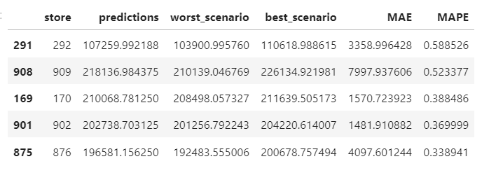

## 7. Conclusão
As metas estabelecidas durante o projeto foram atendidas. É possível verificar que, comparando o cálculo da média com a previsão de vendas das 1115 lojas participantes da análise, proveniente do modelo XGBoost, é possível afirmar que o modelo treinado, apresenta um erro menor em torno de 34%. Com o levantamento desses valores por loja, é mais fácil para o CFO planejar a reforma.
Além disso, a implementação da solução, conta com a visualização das previsões em tempo real, inclusive pelo celular, em um aplicativo de mensagens, onde o CFO indica a loja e tem o retorno da previsão.
O fluxograma abaixo, mostra a construção do Bot, o aplicativo utilizado pelo usuário, para obter as  previsões de vendas das lojas em seu celular:

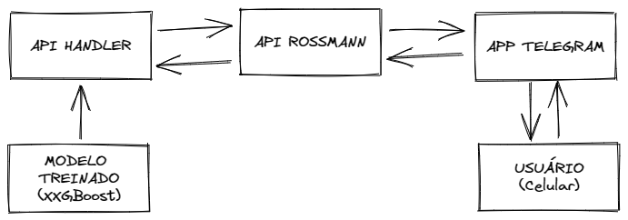

## 8. Referências
* O projeto foi construído junto à Comunidade DS, no curso DS em Produção.
* O dataset foi extraído da plataforma kaggle.
* As imagens utilizadas são do meu acervo pessoal.

